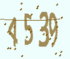
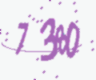
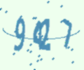
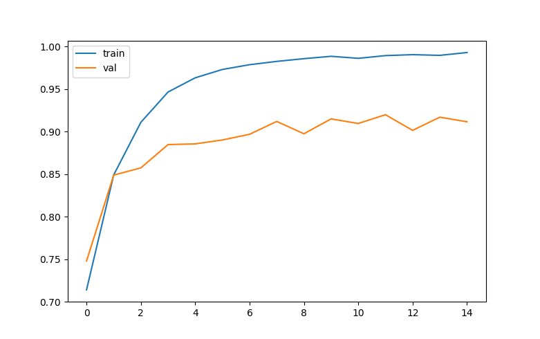

# Captcha Solver

## Requirements

```
pip install -r requirements.txt
```

## Data Input

The module `gen_data.py` will generate captcha image for train, val and test phase.

```
gen_data.py [-h] [-n N] [-t T] [-d] [-l] [-u] [--npi NPI] [--data_dir DATA_DIR]

Optional arguments:

  -h, --help           show this help message and exit
  -n N                 epoch number of character permutations.
  -t T                 ratio of test dataset.
  -d, --digit          use digits in dataset.
  -l, --lower          use lowercase in dataset.
  -u, --upper          use uppercase in dataset.
  --npi NPI            number of characters per image.
  --data_dir DATA_DIR  where data will be saved.
```

## Run:

The module `train.py` will train model.

```
train.py [-h] [-d DATA_DIR] [--lr LR] [--batch BATCH] [-e EPOCH]

Optional arguments:

  -h, --help            show this help message and exit
  -d DATA_DIR, --data_dir DATA_DIR
                        image data folder.
  --lr LR               learning rate.
  --batch BATCH         batch size.
  -e EPOCH, --epoch EPOCH
                        number of epoch for training.
```

## Result

We test on dataset with 4 number on each image. Example:

|           4539            |           7380            |           9427            |
| :-----------------------: | :-----------------------: | :-----------------------: |
|  |  |  |

And that is result:


The best accuracy is **0.919841**, in epoch 11. And the test accuracy is **0.919642**

## Contributors:

- 🐔 [@tiena2cva](https://github.com/tiena2cva)
- 🐮 [@honghanhh](https://github.com/honghanhh)
